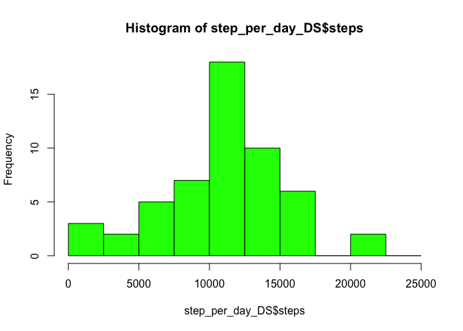
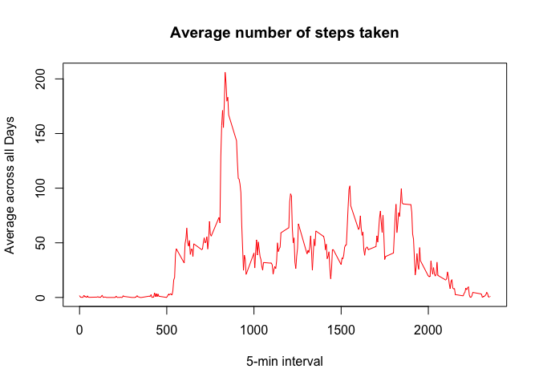
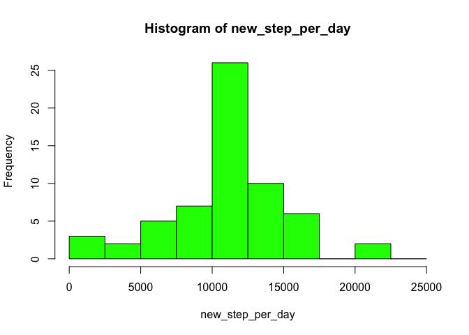
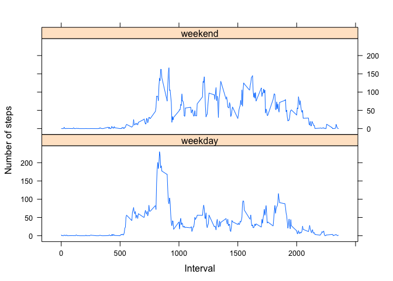

# Reproducible Research: Peer Assessment 1
## Loading and preprocessing the data

Loading Data:


```r
activity <- read.csv(file="activity.csv",head=TRUE,sep=",",colClasses = c("numeric", "character", 
    "numeric"))
summary(activity)
```

```
##      steps            date              interval     
##  Min.   :  0.00   Length:17568       Min.   :   0.0  
##  1st Qu.:  0.00   Class :character   1st Qu.: 588.8  
##  Median :  0.00   Mode  :character   Median :1177.5  
##  Mean   : 37.38                      Mean   :1177.5  
##  3rd Qu.: 12.00                      3rd Qu.:1766.2  
##  Max.   :806.00                      Max.   :2355.0  
##  NA's   :2304
```
Process Data:

```r
library(lattice)
activity$date <- as.Date(activity$date, "%Y-%m-%d")
```
## What is mean total number of steps taken per day?

Calculate number of steps taken per day:

```r
step_per_day_DS =  aggregate(steps ~ date, data = activity, sum, na.rm = TRUE)
```
Make histograms of number of steps taken per day:

```r
hist_info <- hist(step_per_day_DS$steps,breaks=seq(from=0, to=25000, by=2500),col="green")
```

 

Calculate and display mean and median of the total number of steps taken per day:

```r
mean_step <- mean(step_per_day_DS$steps)
mean_step
```

```
## [1] 10766.19
```

```r
med_step <- median(step_per_day_DS$steps)
med_step
```

```
## [1] 10765
```

## What is the average daily activity pattern?

Make a time series plot of the 5-minute interval (x-axis) and the average number of steps taken, averaged across all days (y-axis):


```r
mean_step_interval <- tapply(activity$steps, activity$interval, mean, na.rm = TRUE)
plot(row.names(mean_step_interval), mean_step_interval, type = "l", xlab = "5-min interval", 
    ylab = "Average across all Days", main = "Average number of steps taken", 
    col = "red")
```

 

Which 5-minute interval, on average across all the days in the dataset, contains the maximum number of steps?

```r
max_interval <- which.max(mean_step_interval)
max_interval
```

```
## 835 
## 104
```

## Imputing missing values

Calculate and report the total number of missing values in the dataset:

```r
activity_NA <- sum(is.na(activity))
activity_NA
```

```
## [1] 2304
```

 Filling in all of the missing values in the dataset with mean value for that date

```r
fillNA <- numeric()
avg_step_int_DS <- aggregate(steps ~ interval, data = activity, FUN = mean)
for (i in 1:nrow(activity)) {
    obs <- activity[i, ]
    if (is.na(obs$steps)) {
        steps <- subset(avg_step_int_DS, interval == obs$interval)$steps
    } else {
        steps <- obs$steps
    }
    fillNA <- c(fillNA,steps)
}
```
Create a new dataset that is equal to the original dataset but with the missing data filled in.

```r
new_activity <- activity
new_activity$steps <- fillNA
```
Make a histogram of the total number of steps taken each day 

```r
new_step_per_day =tapply(new_activity$steps, new_activity$date, FUN=sum,na.rm=TRUE)
hist_info <- hist(new_step_per_day,breaks=seq(from=0, to=25000, by=2500),col="green")
```

 
Calculate and report the mean and median total number of steps taken per day.

```r
new_mean_step <- mean(new_step_per_day)
new_mean_step
```

```
## [1] 10766.19
```

```r
new_med_step <- median(new_step_per_day)
new_med_step
```

```
## [1] 10766.19
```
These values are quite similar with the previous case when we have not replaced missing NAs. Mean stays the same while median increases.

## Are there differences in activity patterns between weekdays and weekends?

Create a new factor variable in the dataset with two levels – “weekday” and “weekend” indicating whether a given date is a weekday or weekend day.


```r
weekdays <- c('Monday', 'Tuesday', 'Wednesday', 'Thursday', 'Friday')       
new_activity$day_type <- c('weekend', 'weekday')[(weekdays(new_activity$date) %in% weekdays)+1L]
head(new_activity)
```

```
##       steps       date interval day_type
## 1 1.7169811 2012-10-01        0  weekday
## 2 0.3396226 2012-10-01        5  weekday
## 3 0.1320755 2012-10-01       10  weekday
## 4 0.1509434 2012-10-01       15  weekday
## 5 0.0754717 2012-10-01       20  weekday
## 6 2.0943396 2012-10-01       25  weekday
```

Make a panel plot containing a time series plot of the 5-minute interval (x-axis) and the average number of steps taken, averaged across all weekday days or weekend days (y-axis). 


```r
steps_per_level <- aggregate(steps ~ interval + day_type, data = new_activity, mean)
xyplot(steps ~ interval | day_type, steps_per_level, type = "l", layout = c(1, 2), 
    xlab = "Interval", ylab = "Number of steps")
```

 

